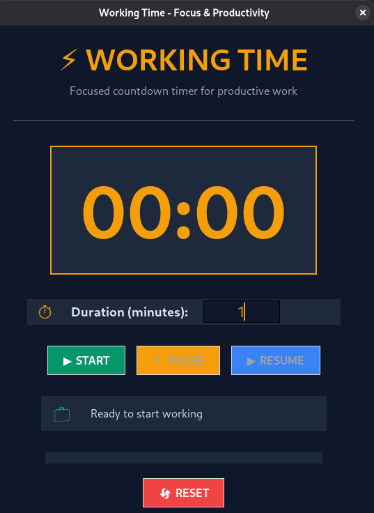
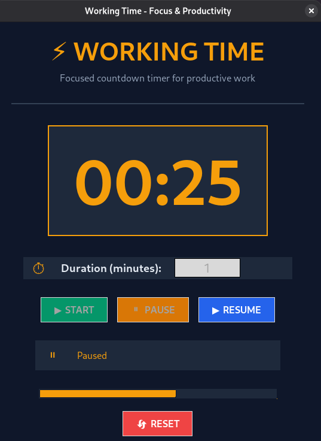
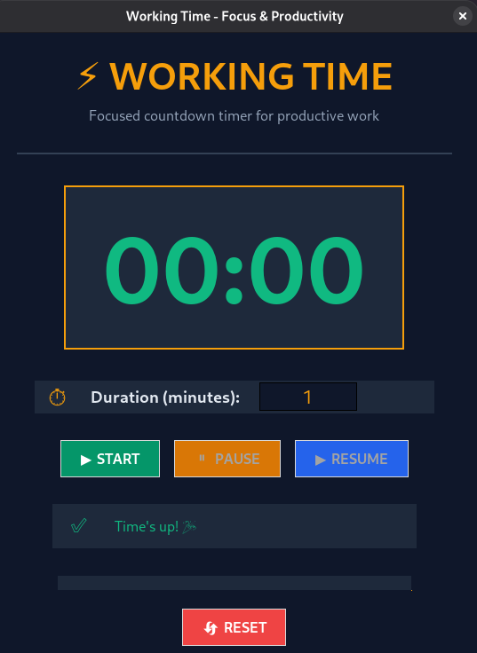
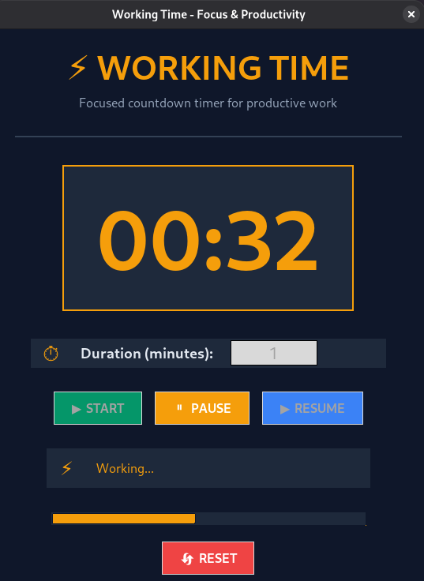

# python work timer For all developers (V2.0)

This post is about a Pomodoro timer script that was created specifically for developers so they can have a break between work. Stay tuned with us.
---

# Features:
1. Error Handling
2. exact time
3. input management
4. UI with tkinter with the Help of AI

---
# Result:









---

# What Is Work Time:

**This program is designed to add focus to the work and encourage the programmer to work even when they are unmotivated to finish the timer.**

---

# Run code


```bash
sudo apt install -y python3-full
cd work_timer
python3 main.py
```

---

# -👤Created By CAgent_47 & Dev-vesper

# -📜MTA Scripter • Linux Learner🐧 • python Learning Developer • Bash Scripter • Sql •🇺🇸🔥
---
**Topics:** 
[#Bash](https://github.com/topics/bash) •
[#Linux](https://github.com/topics/linux) •
[#Automation](https://github.com/topics/automation) •
[#Python](https://github.com/topics/python)
---

